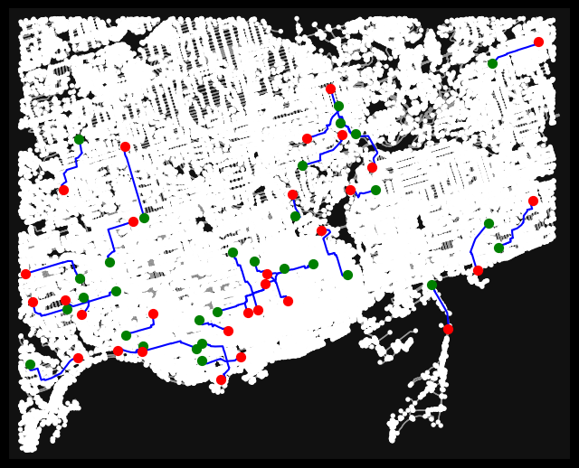
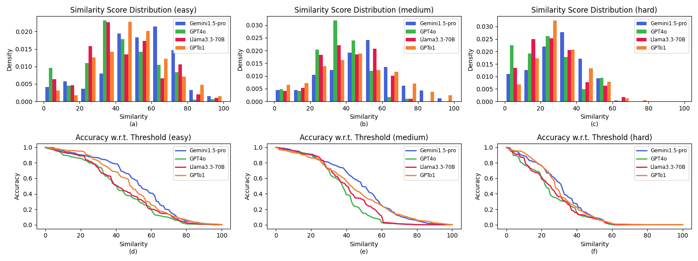

# TurnBack

English | [简体中文](README.zh-CN.md)

Public release for **TurnBack: A Geospatial Route Cognition Benchmark for Large Language Models through Reverse Route**.

This repository is intentionally narrow. It gives you exactly four practical pieces:

1. `36kroutes/`: the released raw route corpus
2. `path-builder execute`: the public Path Builder executor
3. `path-builder generate-routes`: the easy / medium / hard route generator
4. `path-builder generate-reverse`: the reverse-instruction generator for external LLM APIs

## Paper Overview

TurnBack studies **route reversal** as a concrete probe of geospatial cognition in large language models. A model receives forward navigation instructions and must produce a reverse route back to the start. We then use Path Builder to convert the predicted reverse instructions into geometry and compare that recovered route against the reference reverse route.

The paper contributes three pieces:

- a large-scale route-reversal benchmark introduced in the paper as `36,000` pedestrian routes over `12` metropolitan areas
- Path Builder, a language-to-route execution engine that turns navigation text back into street-level geometry
- a route-level evaluation protocol based on recovered geometry instead of only surface-form text overlap




## Lightweight vLLM Evaluation Workflow

This branch is set up for the server workflow used by the sibling K2, USTBench,
and STARK_Benchmark evaluation forks. From a fresh clone on an evaluation
server:

```bash
uv sync
bash scripts/prepare_eval_data.sh
```

`prepare_eval_data.sh` downloads the Hugging Face dataset
`zhangdw/TurnBack-10pct` into a stable cache under `${TMPDIR:-/tmp}` and installs
its evaluation JSONL at:

```text
data/turnback_10pct.jsonl
```

Then evaluate a Qwen3 model already deployed by vLLM/OpenAI-compatible chat
completions:

```bash
bash scripts/run_vllm_eval.sh \
  --model qwen3-4b-thinking-2507 \
  --base-url http://127.0.0.1:8000/v1 \
  --api-key EMPTY \
  --jobs 8
```

`--jobs` is the concurrency knob. Results are written under:

```text
results/<served-model-name>/turnback_10pct.jsonl
results/<served-model-name>/turnback_10pct_summary.json
```

The evaluator is resume-aware by default. Rerunning the same command skips only
samples that already have a completed record with matching sample id, matching
source signature, `parser_status=ok`, and a finite similarity score. Interrupted
or malformed JSONL lines, API errors, parse failures, and execution failures are
left pending. Use `--force` only for an intentional full rerun.

Estimate progress with the same completion rule:

```bash
uv run python scripts/estimate_eval_progress.py --model qwen3-4b-thinking-2507
```

Sync results to Hugging Face Buckets and later pull them on another machine:

```bash
hfsync/local_to_remote.sh --dry-run
hfsync/local_to_remote.sh

# On the analysis machine:
hfsync/remote_to_local.sh
```

By default the bucket destination is
`hf://buckets/zhangdw/leo-benchmark/TurnBack/results`. Override it with
`HF_BUCKET_ID`, `HF_TURNBACK_PREFIX`, or the scripts' `--bucket` / `--prefix`
options.

## Quick Start

Install for local development:

```bash
uv sync --extra dev --extra llm
```

Generate new routes in three difficulty levels:

```bash
path-builder generate-routes \
  --city Toronto_Canada \
  --easy <NUM_EASY> \
  --medium <NUM_MEDIUM> \
  --hard <NUM_HARD> \
  --output-root tmp/generated_routes \
  --ors-api-key "$ORS_API_KEY"
```

Generate reverse instructions with your own LLM API key:

```bash
path-builder generate-reverse \
  --provider openai \
  --city "Toronto, Canada" \
  --input-file 36kroutes/Toronto_Canada/easy/<ROUTE_ID>/natural_instructions.txt \
  --raw-output tmp/reverse_raw.txt \
  --clean-output tmp/reverse_clean.txt
```

Execute the reversed instructions with Path Builder:

```bash
path-builder execute \
  --root 36kroutes \
  --city Toronto_Canada \
  --difficulty easy \
  <ROUTE_ID> \
  --instructions tmp/reverse_clean.txt \
  --executor hybrid \
  --output tmp/recovered_route.geojson
```

Score the recovered route against the reference route:

```bash
path-builder score \
  tmp/recovered_route.geojson \
  36kroutes/Toronto_Canada/easy/<ROUTE_ID>/route.geojson \
  --config configs/similarity.paper.json
```

## Main Findings



- The paper introduces a `36,000`-route benchmark over `12` metropolitan areas and three difficulty levels.
- The paper reports that Path Builder reaches `96%` success in Toronto, `90%` in Tokyo, and `94%` in Munich.
- On a representative easy reversal example, no model returned exactly to the start; Gemini reached `73.4` similarity while Llama reached `22.6`.
- On `200` easy Toronto routes with GPT-4o, adding a vector map at inference time raised return rate from `6.4%` to `43.7%` and similarity from `41.06` to `73.08`.

## Why Is The Folder Still Named `36kroutes`?

`36kroutes` is the historical release name used in the paper. The directory currently published in this repository is a later raw release snapshot kept under the same name for continuity.

The paper-reported `36,000` routes refer to the benchmark definition in the paper. The repository keeps the historical `36kroutes` folder name for continuity across released data and code. Directory-level details are documented in [36kroutes/README.md](36kroutes/README.md).

## Repository Layout

```text
.
├── 36kroutes/                # released raw route corpus
├── assets/                   # figures reused from the paper
├── configs/similarity.paper.json
├── src/path_builder/         # Path Builder, route generation, prompting, scoring
├── scripts/                  # data prep, vLLM eval, progress, local smoke test
├── hfsync/                   # HF bucket upload/download helpers
├── tests/                    # public test suite
├── README.md                 # English README
├── README.zh-CN.md           # Chinese README
├── CITATION.cff
└── pyproject.toml
```

## Quick Check

```bash
uv run ruff check src/path_builder tests scripts --select F,E9
uv run python -m compileall src/path_builder scripts
uv run pytest -q
bash scripts/quick_check.sh
```

## Citation

If you use the code or data, please cite the TurnBack paper. Citation metadata is provided in [CITATION.cff](CITATION.cff).
